# Sept 4 : Started the schematic

Today i started the first part of lux , i simply designed the initial base(i mean schematic only) of pcb now gonna polish tht . Heres an img :
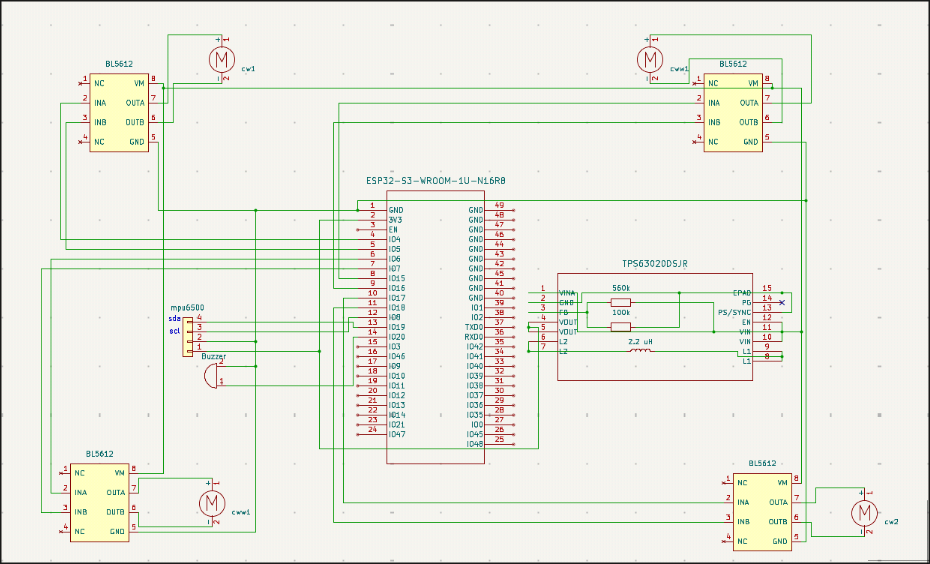
So to be frank it took me hours to make the decisions for the h bridge driver , the buck converter and both of them not out of stock everywhere
, i chose bl5612 for the h bridge driver , looks good enough but for the buck , i chosed ams1117 first then came to know its really inefficient and a 1s battery cant reliably suppy for it ,so i went to TPS63020DSJR  but soon i came to realize why it wasnt a good choice for me . THe wiring of it is really complex thts all still i somehow did it , now the next for tomorrow , i need to make the rails for ttl and start the pcb maybe? Also today i connected the mpu6500 ,it might look in complete but i intend to solder the breakout directly on my pcb(ah cant find bare cheaper than the breakout) so only 4 pins(gnd vcc scl and sda) are good enough no need for more hassle .

**Total time spent: 4 hours**

# Sept 5 : 

I already have the probs i need to solve but i made a new decision , i will just wire the d+ and d- on io20 and 19 , so no cp2102 as the esp already have the required pins , why waste money? 

But now i have mapped d+ and d- to gpio20 and 19 so now i need to remount the buzzer also the mpu , i think if i am rewiring , why not spi thts cleaner than i2c for a flight controller , so now i need conn_01x10 instead . Uf finally done now i need to add some good looking caps and then done the schematic , wait i have already spent 3hrs and basically did nothing but read datasheets and clculated the values for caps and wired some small things , ah! .

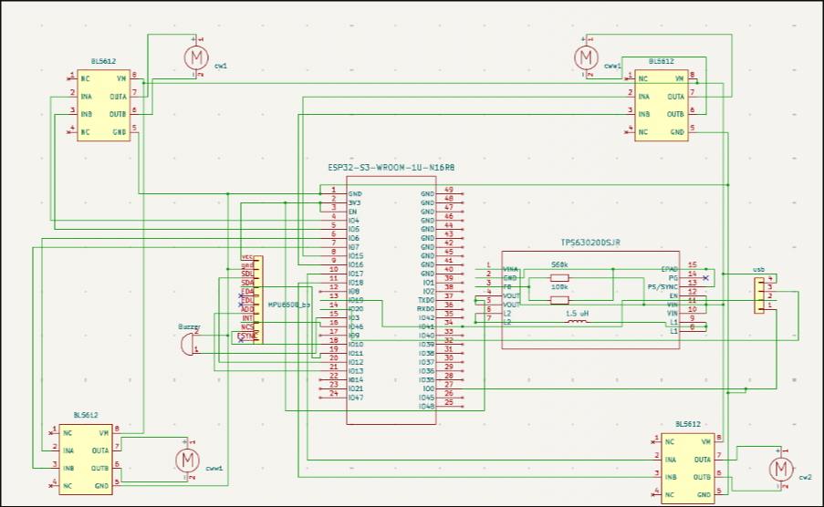

Now when i went to robu for the caps , i saw those cheap as hell but then comes 10rs is min for a single comp , i really need to order whole 25 caps just to fullfill their condition of 10rs minimum , anyways bulk costs way cheaper , when i tried to find alts , i saw each costing 3rs while on bulk 
the same comp(from diff company) costs 0.40rs each. For the first time i am ordering more things to save money lol .

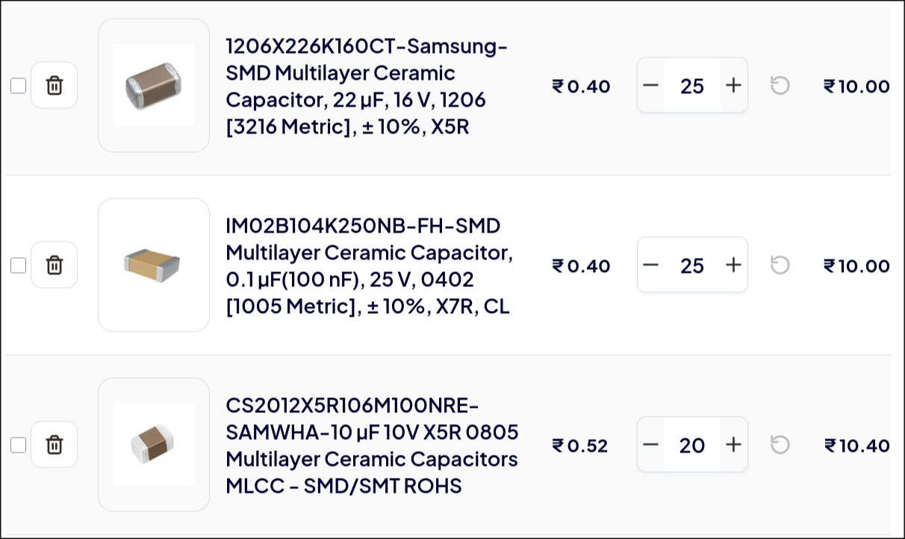

Finally done the caps arc Imma gonna die if i sill continue .

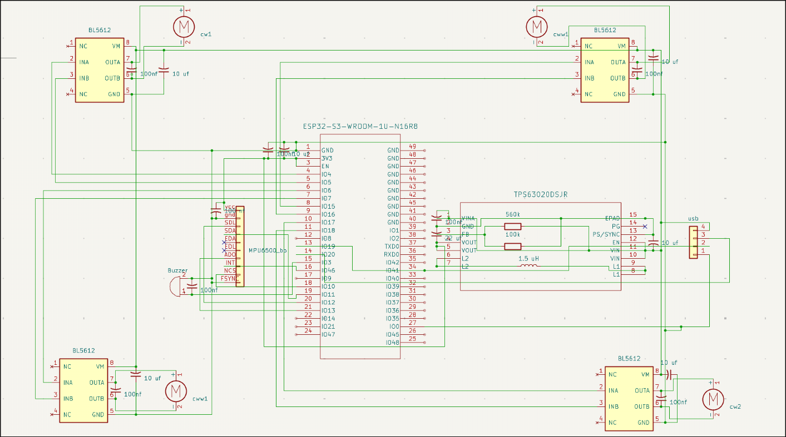

**Total time spent: 6 hours**

# Sept 6 : Footprint + pcb 

At firsted i started off with the usb connection , it might have looked finished but the old connection wd have caused the esp to struck in bootloader always so i did a easy trick diode between io0 and gnd done .

Next the battery the one in my cart is a bonka 600mah 25c 1s lipo , and it have jst output but i cant get the exact size of the connecter , so i am just gonna leave the pcb with a conn_01x02 for the battery lol .

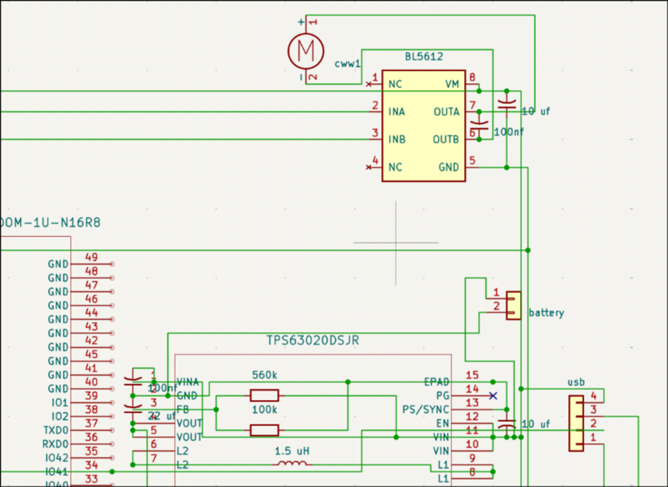

next if footprints : it took me literal an hour to find the exact footprints , it was hell , metric vs normal size of smd . As i was doin it for the first time , i sucked even more still somehow i pulled it off . And for the sod diode section it was too confusing .

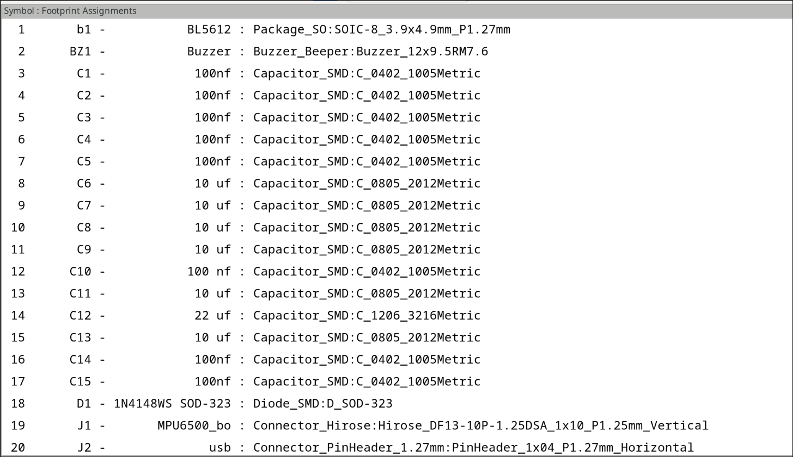

Now after tht i went to the pcb , and i came to know i only have 90x26mm space for the pcb . I tried to route and saw my mpu isnt connected to anything just because i changed the pin names from the original footprint , ah! .  Now i have 2 options either to go with the old pin 1-10 or make my own footprint for the mpu , quite a hard decision ! i took the easy one and reverted .

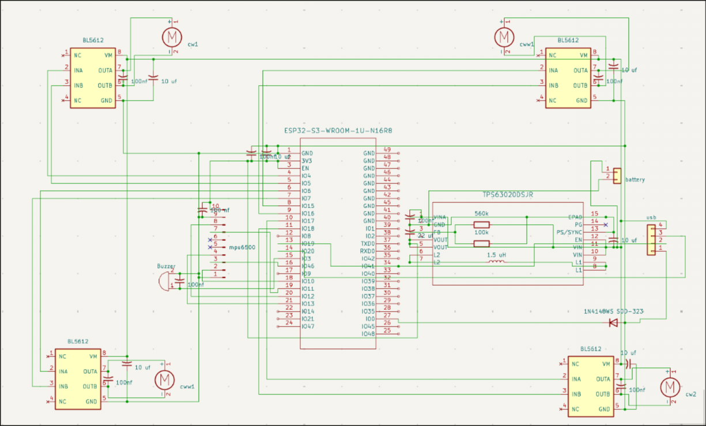

now imma gonna do the pcb but before tht i have the frames size

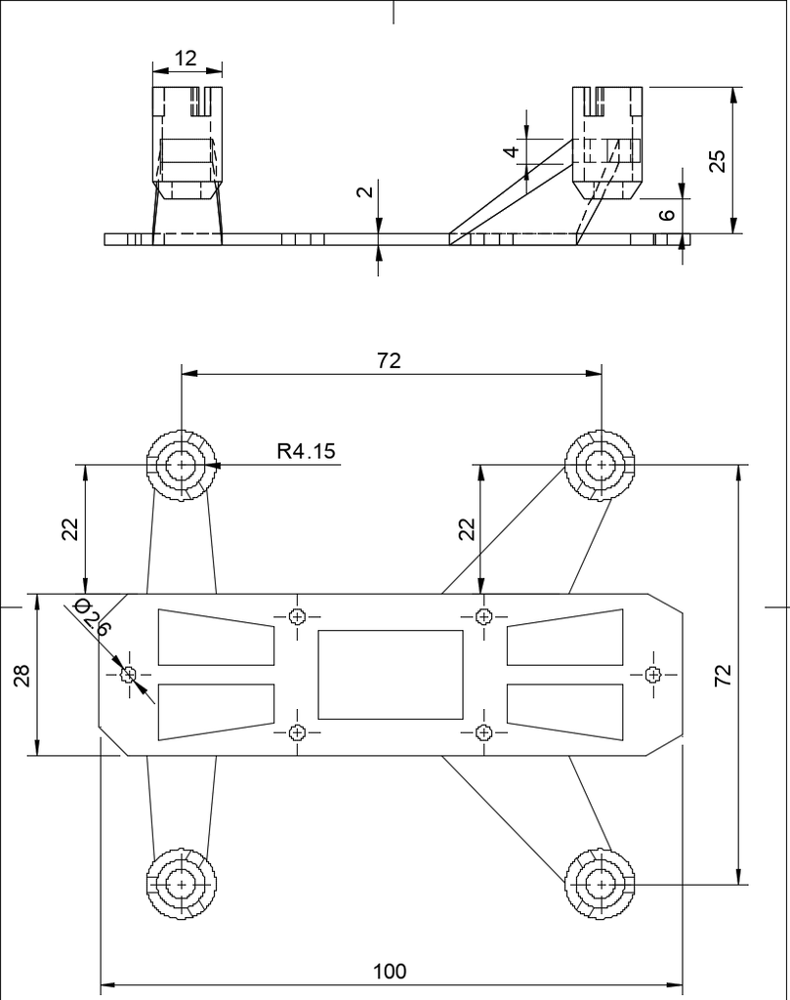

i have measured i need 91x26mm^2 pcb tht will do the work probably. Now the main work routing the pcb . 
Why it looks this messy !!

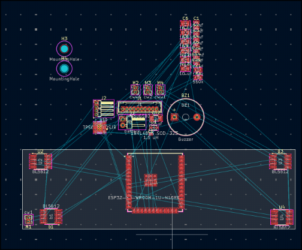

Actually i chosed the wrong footprint for the inductor too :x why it only happens with me ahhhhhhhhhhhhhhhhhhh. Ok i upgraded the footpring bt now it look like really big.

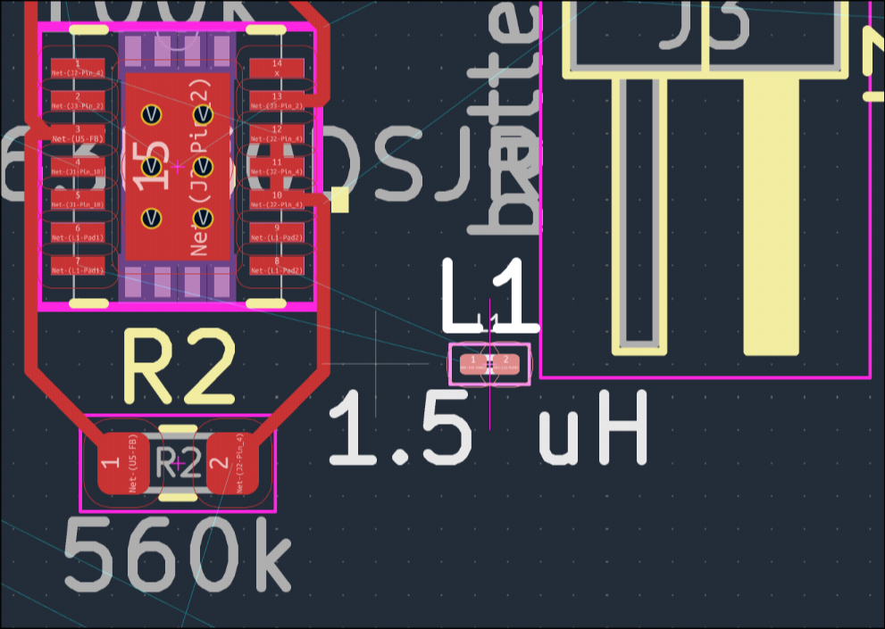

i literally tried to wire those every thing in just 2 layers its toooo hard for me ah!

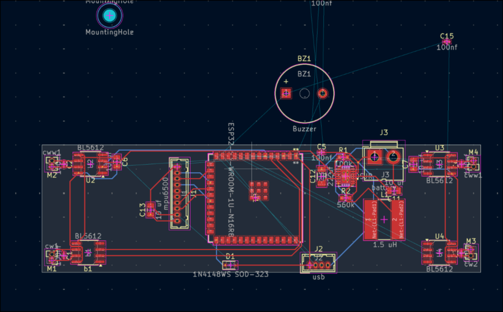

lol I HAD TOO MANY ERRORS IN THE SCHEMATIC NOW NEED TO REFACTOR THE SCHEMATIC FIRST aAHHHHHHHHHHHHHHHHHHHHHHHHHHHHHHHHHHHHHHHHHHH.Its already 6hrs ahh .

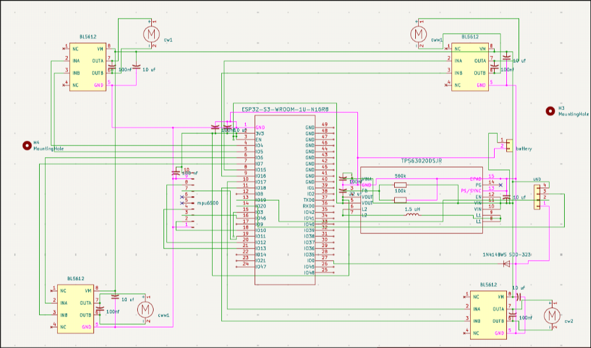

finally this time i examined it carefully before goin to pcb , now lets do the pcb shit again .
Ok this time i place the motor positions with a scale , i mean i measured the motors position wrt to the frame and placed the comps now need to wire .

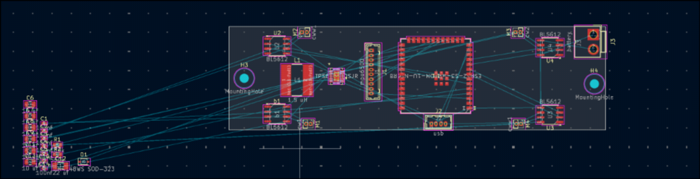

Ahh again after another hour i kinda did the placement , take a look here 

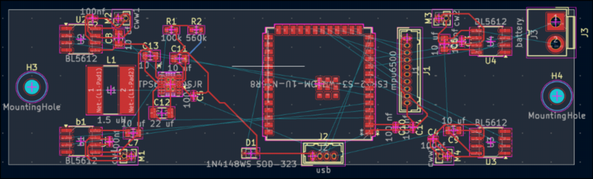

Finally done i am crying , wait i didnt run drc .

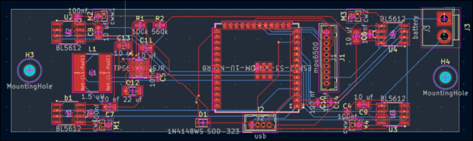

DRC says i have errors but thts mostly trash as it says my yps63022's footprint has lower sized hole than the min , ahh my eyes are on fire ,i need to sleep still imma gonna fix it first .

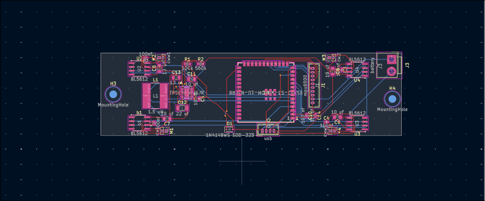

looks like fixed and now i have a new job which is to add the drone's frame and pcb both in freecad and then check . 
It had a lil screw fitting issue i fixed tht but forgot to sc ah ! 

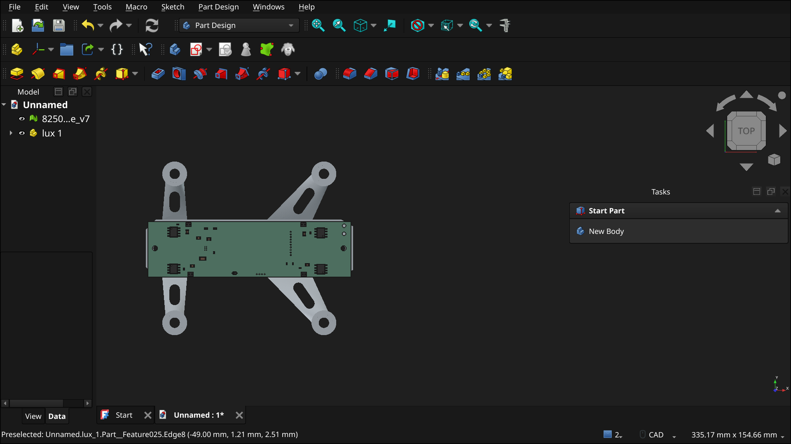

This time i cut the pcb a lil to make it favorable with the 3d frame and this is the final result 

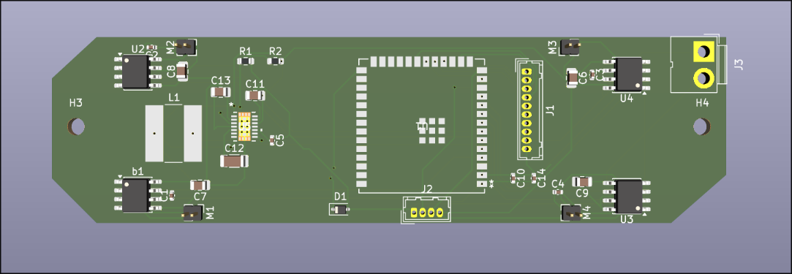

look like this is all i can do for today . Also looks like the designing part is complete ok then heres the final look: 

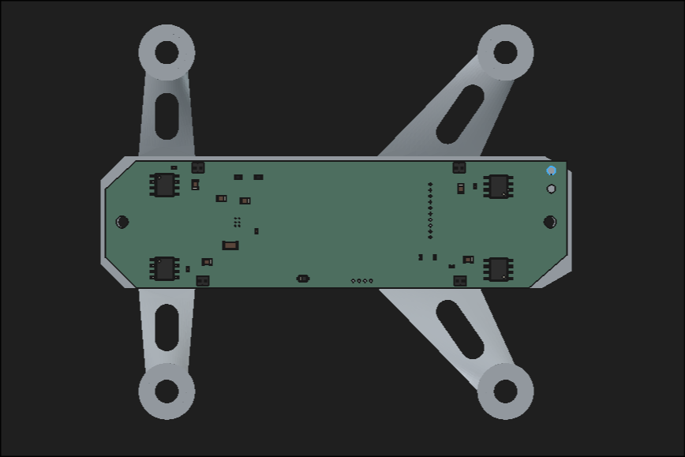

**Total time spent: 11 hours**

# Sept 6 : cost estimation + readme fix

Today i didnt do much things just estimated the cost of pcb manufacturing and 3d printing i tried diff platforms like robu and jlcpcb also lion circuits but for pcb and 3d both jlcpcb makes it cheaper so why not , also with a 10$ coupon the shipping is free .

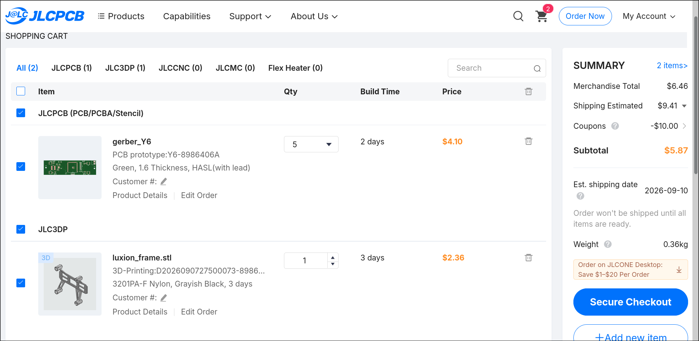

After that i tried a lot to find robu coupons too but i was unable to find so i basically gave up and went to readme , patched and thts all 

**Total time spent: 2 hours**

# Sept 7 : Wiring added to readme + bug found

today my work is minimal as i have a small exam , i just added the wiring portion to readme and found a bug ,
after reading the esp datasheet i came to know there is a strapping problem for gpio46 in my gerber ,
i mean when download mode with the usb , i need to pull tht down .

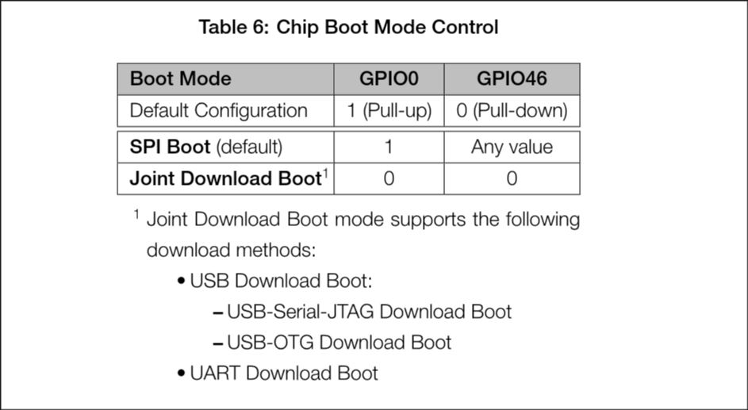

**Total time spent: 1 hours**
