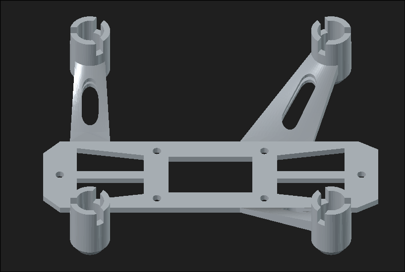

# Luxion 

Luxion is a custom made drone made with rust unlike standard c++ drones .
It uses a custom pcb, ESP32-S3-WROOM-1U , MPU6500-IMU(breakout as it costs less than the bare), four motor drivers, and a 1S LiPo to power the drone.
The firmware is still on the way , gonna finish it by next week .

## Function

It is a remote(phone/remote) controlled drone made from absolutely nothing , with 8520 motors and 65mm props it can easily take off with 2+ thrust-mass ratio . It is ideal for mini quadcoptor with mountable sensors ,as it has a lot of gpio's left any sensor can be easily mounted if not too heavy .

## Why it exists

from when i saw the pluto x  , a programable drone with esp 12f and stm32 , i always wanted to make one myself but better and cheaper thts why luxion exists today. I used esp32 instead of 2 mcu's , gonna use esp-now instead of wifi and a lot but the best part i didnt rely on the pluto x's
architecture for luxion but made my whole own .

## Design

### 3D Model

[download](3d/luxion_frame.stl)

also pics here :

---

---

### PCB

### Schematic

### Wiring

io4 -> bl1 ina(cw)
io5 -> bl1 inb(cw)
io6 -> bl2 ina(ccw)
io7 -> bl2 inb(ccw)
io15 -> bl3 ina(ccw)
io16 -> bl3 inb(ccw)
io17 -> bl4 ina (cw)
io18 -> nl4 inb (cw)
io19 -> d-
io20 -> d+
io46 -> int(mpu)
io10 -> ncs
io11 -> sda
io12 -> scl
io13 -> ado

done thts for the mpu 

## Firmware

I intend to use a firmware written in rust no std but it is still on the way.

## How to assemble

Solder all the components from bom(except the antenna) on the pcb ,
also You might need to solder a jst socket according to your battery 
(more detailed explanation after i do it myself first lol)

## Credits

This project uses:

- KiCad
- Blender for 3D renders
- A opensource frame from the link below

[link](https://www.thingiverse.com/thing:5013951)

## JLCPCB order

> the price might fluctuate over time

## Bill of Materials

Part,Quantity,Unit Price (INR),Unit Price (USD),Total (INR),Total (USD),Link
ESP32-S3-WROOM-1U-N16R8,1,469.00,4.94,469.00,4.94,https://robu.in/product/espressif-esp32-s3-wroom-1u-n16r8-module/
MPU6500 IMU,1,142.00,1.49,142.00,1.49,https://robu.in/product/mpu6500-gyroscope-accelerometer-digital-motion-processor-dmp-6-axis-motion-sensor-with-i2c-spi-interface/
BL5612-BL H-Bridge Motor Driver,4,31.00,0.33,124.00,1.31,https://robu.in/product/bl5612-blshanghai-belling-h-bridge-motor-driver-ic-1-5a-sop-8/
TPS63020DSJR Buck-Boost Converter,1,124.00,1.31,124.00,1.31,https://robu.in/product/tps63020dsjr-texas-instruments-boost-type-adjustable-1-2v5-5v-1-8v5-5v-vson-14-ep3x4-dc-dc-converters-rohs/
Bonka 3.7V 600mAh 25C 1S LiPo,1,499.00,5.25,499.00,5.25,https://robu.in/product/bonka-3-7v-600mah-25c-1s-lithium-polymer-battery-pack/
8520 Coreless Motor 2xCW + 2xCCW Pack,1,479.00,5.04,479.00,5.04,https://robu.in/product/8520-magnetic-micro-coreless-motor-for-micro-quadcopters-2xcw-2xccw/
SRN8040-1R5Y 1.5uH Inductor,1,23.00,0.24,23.00,0.24,https://robu.in/product/srn8040-1r5y-bourns-srn8040-1r5y-power-inductor-smd-1-5-%c2%b5h-7-a-shielded-8-2-a-srn8040-series/
22uF 16V 1206 Capacitor,25 (MOQ),0.40,0.004,10.00,0.11,https://robu.in/product/1206x226k160ct-samsung-smd-multilayer-ceramic-capacitor-22-%c2%b5f-16-v-1206-3216-metric-%c2%b1-10-x5r/
100nF 25V 0402 Capacitor,25 (MOQ),0.40,0.004,10.00,0.11,https://robu.in/product/im02b104k250nb-fh-smd-multilayer-ceramic-capacitor-0-1-%c2%b5f100-nf-25-v-0402-1005-metric-%c2%b1-10-x7r-cl/
10uF 10V 0805 Capacitor,20 (MOQ),0.52,0.005,10.40,0.11,https://robu.in/product/cs2012x5r106m100nre-samwha-10-%c2%b5f-10v-x5r-0805-multilayer-ceramic-capacitors-mlcc-smd-smt-rohs/
100kOhm 0603 Resistor,28 (MOQ),0.37,0.004,10.36,0.11,https://robu.in/product/100k-ohm-1-4w-0603-surface-mount-chip-resistor-pack-of-100/
560kOhm 0603 Resistor,28 (MOQ),0.36,0.004,10.08,0.11,https://robu.in/product/erjp03j564v-panasonic-200mw-thick-film-resistors-%c2%b15-%c2%b1200ppm-%e2%84%83-560k%cf%89-0603-chip-resistor-surface-mount-rohs/
1N4148WS SOD-323 Diode,13 (MOQ),0.77,0.008,10.01,0.11,https://robu.in/product/1n4148ws-sod-323-805-diodereel-of-3000/
FrSky 150mm IPEX4 Antenna,1,42.00,0.44,42.00,0.44,https://robu.in/product/150mm-frsky-receiver-antenna-new-version-ipex4/
JST 2P Male+Female Connector,1,30.00,0.32,30.00,0.32,https://robu.in/product/jst-2p-malefemale-terminal-connection-socket/
PCB,1,389.50,4.10,389.50,4.10,JLCPCB
3D Printed Frame,1,224.20,2.36,224.20,2.36,JLCPCB
TOTAL,,,,2676.55,28.17,

