# Luxion

Luxion is a custom made drone made with rust unlike standard c++ drones .
It uses a custom pcb, ESP32-S3-WROOM-1U , MPU6500-IMU(breakout as it costs less than the bare), four motor drivers, and a 1S LiPo to power the drone. Also a remote with
same esp module, 2x joysticks connectin to the drone via esp-now .

## Function

It is a remote controlled drone made from absolutely nothing , with 8520 motors and 65mm props it can easily take off with 2+ thrust-mass ratio . It is ideal for mini quadcoptor with mountable sensors ,as it has a lot of gpio's left any sensor can be easily mounted if not too heavy .

## Why it exists

from when i saw the pluto x  , a programable drone with esp 12f and stm32 , i always wanted to make one myself but better and cheaper thts why luxion exists today. I used esp32-s3 instead of 2 mcu's , used esp-now instead of wifi and a lot but the best part i didnt rely on the pluto x's architecture at all .

## Design
---

### 3D Model

#### Drone

You can download the 3d model frm here :
[DOWNLOAD THE 3d MODEL](3d/lux.3mf)

also the  fcstd file is tagged here :

[FCSTD](3d/lux.FCStd)

some photos for the frame :

<table>
  <tr>
    <td>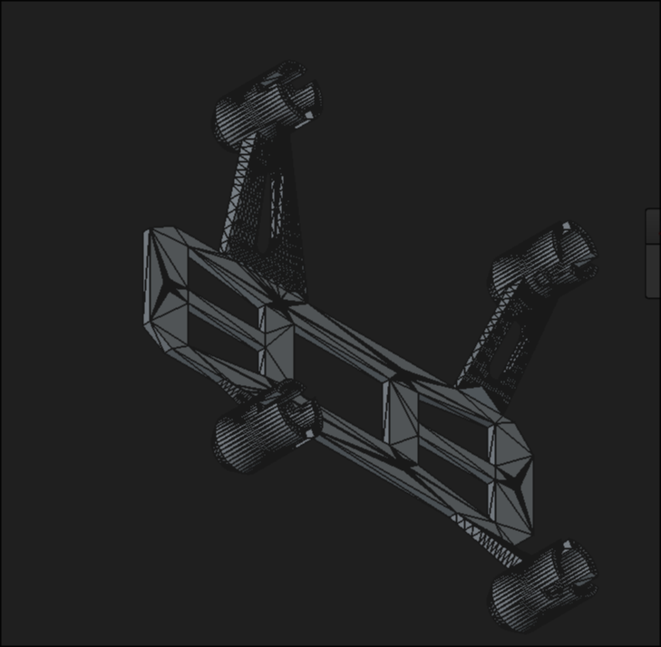</td>
    <td>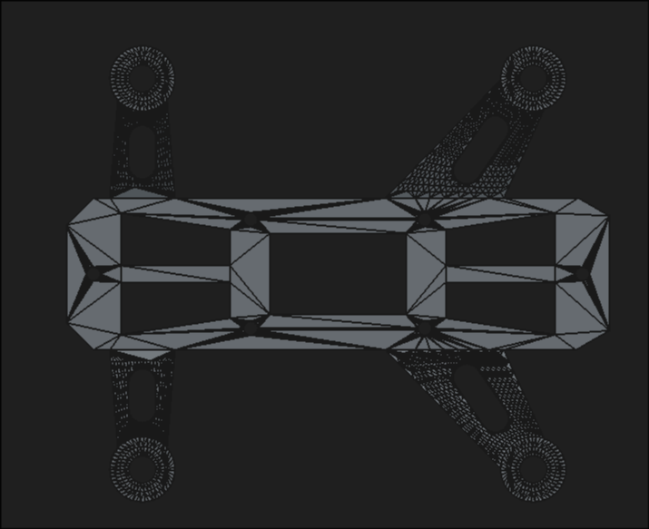</td>
    <td>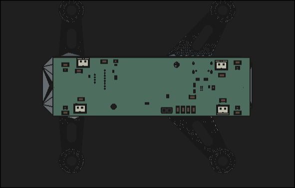</td>
  </tr>
</table>

---

#### Remote

You can download the 3d model frm here :

[DOWNLOAD THE 3d MODEL](3d/remote-body.3mf)
[DOWNLOAD THE 3d MODEL](3d/remote-lid.3mf)

===

also the  fcstd file is tagged here :

[FCSTD](3d/remote.FCStd)

Some phots of the remote :

<table>
  <tr>
    <td>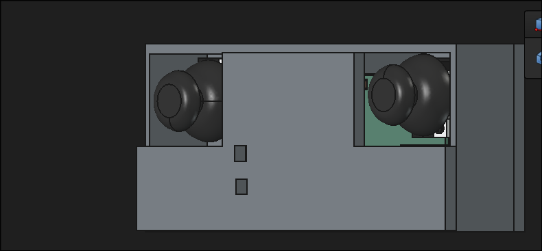</td>
    <td>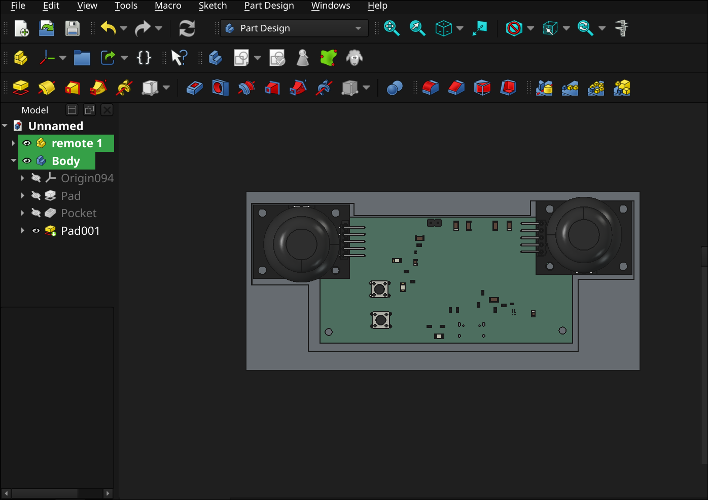</td>
  </tr>
</table>

---

### Schematic
---

#### drone

<table>
  <tr>
    <td>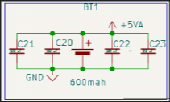</td>
    <td>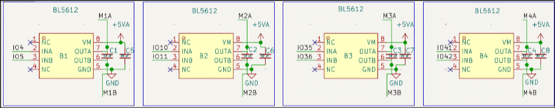</td>
    <td>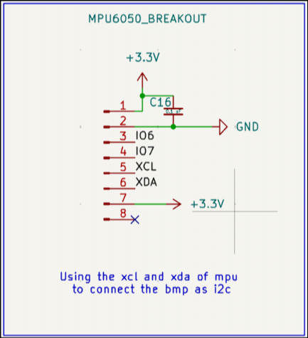</td>
  </tr>
  <tr>
    <td>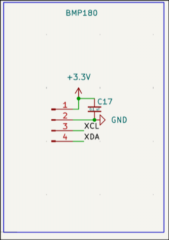</td>
    <td>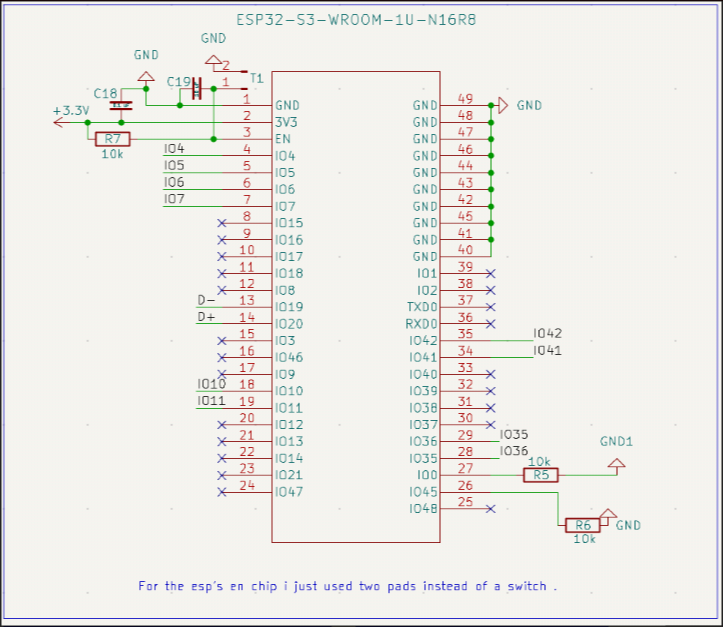</td>
    <td>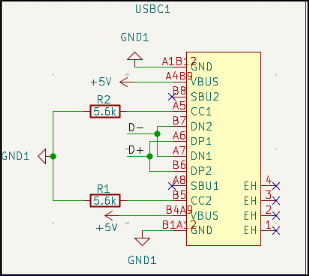</td>
  </tr>
  <tr>
    <td>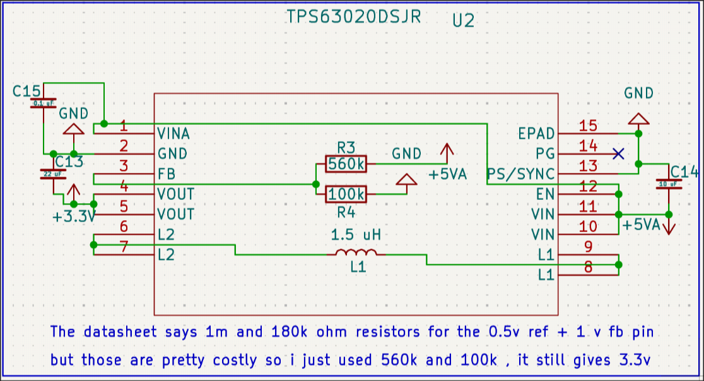</td>
    <td>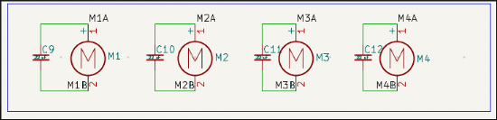</td>
  </tr>
</table>

---

#### remote
---

<table>
  <tr>
    <td>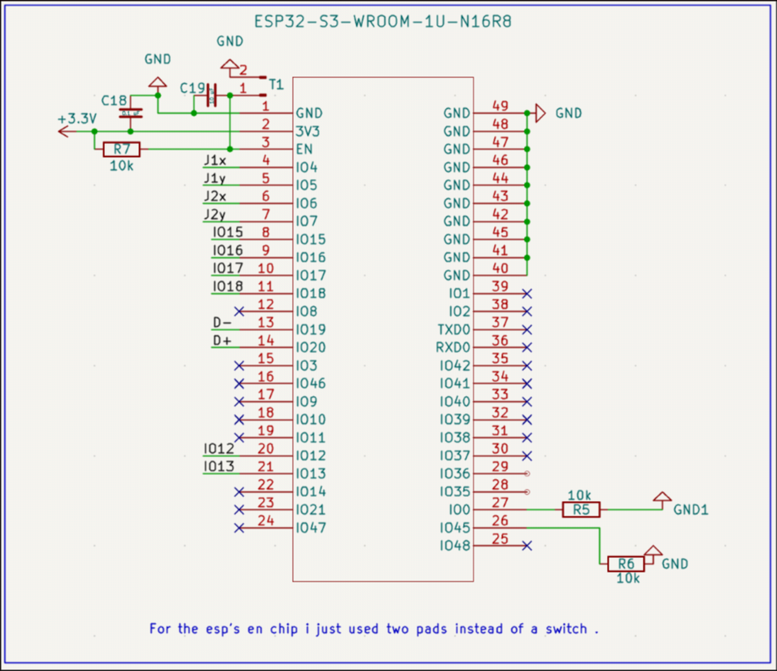</td>
    <td>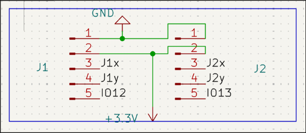</td>
  </tr>
  <tr>
    <td>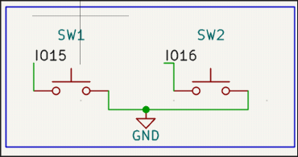</td>
    <td>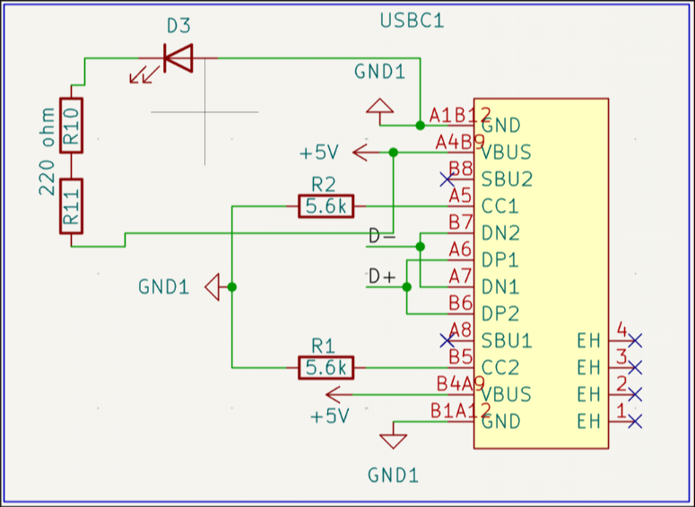</td>
  </tr>
</table>

### PCB

#### drone

Heres the pcb :

<table>
  <tr>
    <td>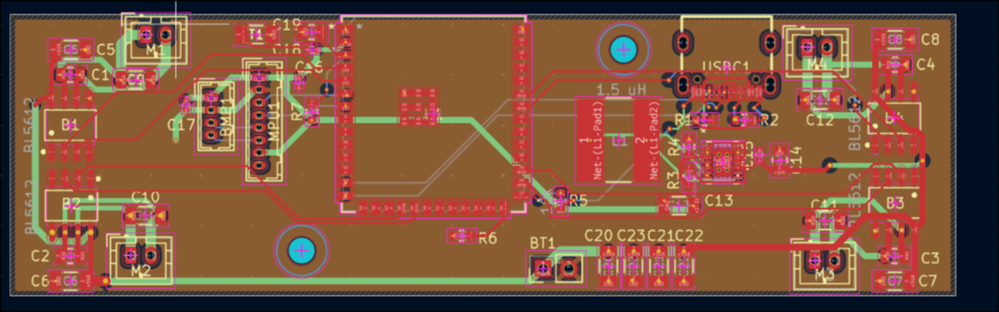</td>
    <td>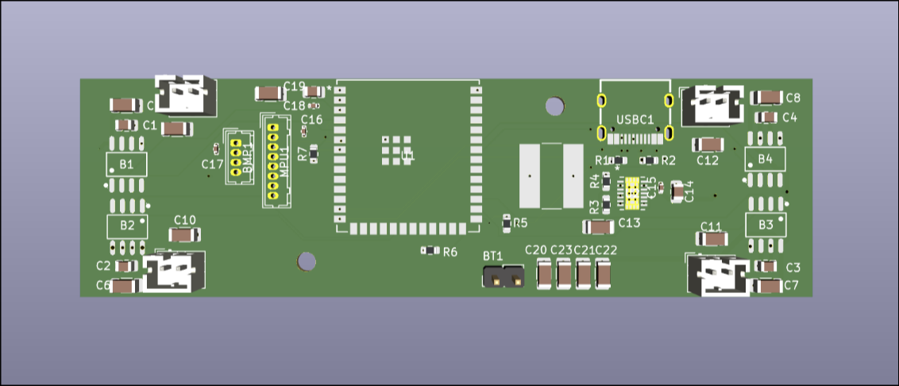</td>
  </tr>
</table>

#### remote

Heres the pcb :

<table>
  <tr>
    <td>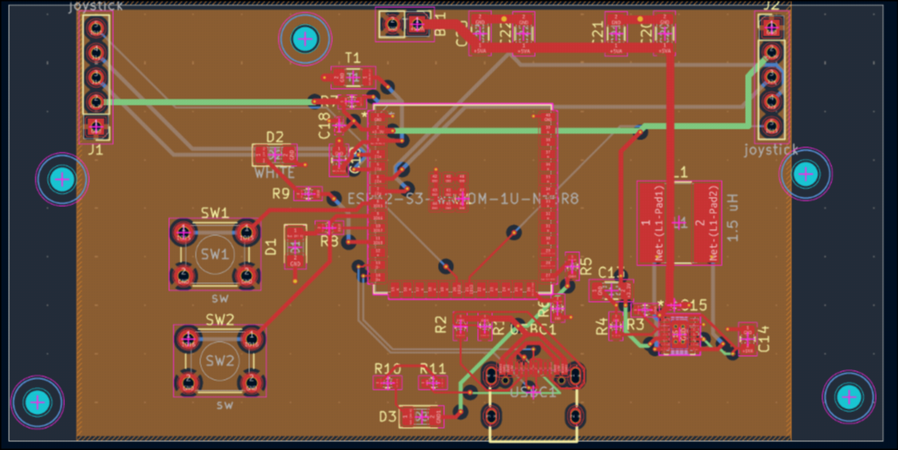</td>
    <td>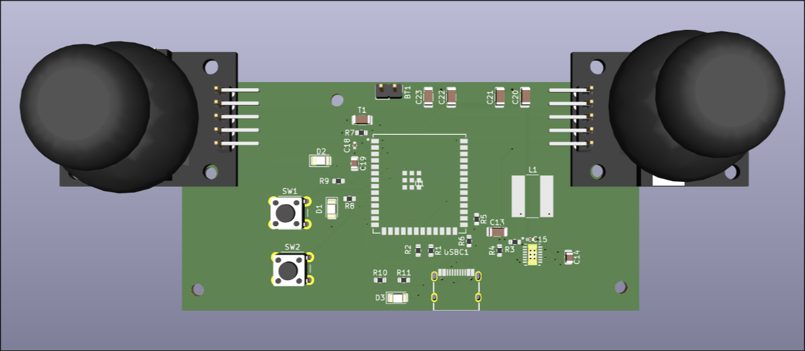</td>
  </tr>
</table>

## Firmware

I have written likely most of the firmware already before getting approved or building the physical drone .

Current stack have :
```
[erox@archbtw luxion]$ tree src 
src
├── filter.rs
├── main.rs
├── motor.rs
├── mpu.rs          
└── pid.rs

1 directory, 5 files
```

the mpu.rs is a custom driver(really basic) for the mpu6050 , the filte* take mpu's data(gyro and acc) then converts tht into yaw roll and pitch , the moto* haved ldec and controlls the motors state , the pid is just pid controller nothing more , and the main.rs integrates them all and runs them when needed either in loop or once .

### Whats remainin?

- esp now impl
- build.rs
- proper pid vals and calibration

## How to assemble

Solder all the components from bom(except the antenna) on the pcb ,
also You might need to solder a jst socket according to your battery
(more detailed explanation after i do it myself first lol)

## Credits

This project uses:

- KiCad
- Freecad for 3D renders
- A opensource frame from the link below

[link](https://www.thingiverse.com/thing:5013951)

> It was the reference for my frame i had to rebuild it .

## JLCPCB order

---
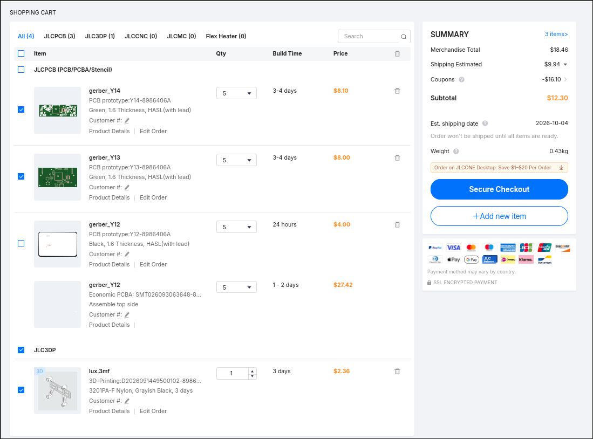
---

> the price might fluctuate over time

## BOM

| Part | Quantity | Unit Price (INR) | Unit Price (USD) | Total (INR) | Total (USD) | Link |
|---|---:|---:|---:|---:|---:|---|
| MPU-6050 3-Axis Accelerometer + Gyro | 1 | 151.00 | 1.59 | 151.00 | 1.59 | [Link](https://robu.in/product/mpu-6050-gyro-sensor-2-accelerometer/) |
| PS2 Joystick Module Breakout Sensor | 2 | 39.00 | 0.41 | 78.00 | 0.82 | [Link](https://robu.in/product/joystick-module-ps2-breakout-sensor/) |
| 8520 Magnetic Micro Coreless Motors – 2xCW + 2xCCW pack | 1 | 459.00 | 4.83 | 459.00 | 4.83 | [Link](https://robu.in/product/8520-magnetic-micro-coreless-motor-for-micro-quadcopters-2xcw-2xccw/) |
| 100kΩ 0603 resistor (MOQ) | 30 | 0.34 | 0.004 | 10.20 | 0.11 | [Link](https://robu.in/product/100k-ohm-1-4w-0603-surface-mount-chip-resistor-pack-of-100/) |
| 220Ω 0603 resistor (MOQ) | 30 | 0.34 | 0.004 | 10.20 | 0.11 | [Link](https://robu.in/product/220-ohm-chip-resistor-1-4w-0603-surface-mount-pack-of-100/) |
| 3V Active Electromagnetic Buzzer – pack of 5 | 1 | 21.00 | 0.22 | 21.00 | 0.22 | [Link](https://robu.in/product/3v-active-electromagnetic-buzzer-pack-of-5/) |
| 1206 Surface Mount LED White (MOQ) | 10 | 1.07 | 0.011 | 10.70 | 0.11 | [Link](https://robu.in/product/1206-surface-mount-led-white-50-pcs/) |
| 1206 Surface Mount LED Yellow (MOQ) | 25 | 0.40 | 0.004 | 10.00 | 0.11 | [Link](https://robu.in/product/1206-surface-mount-led-yellow-50pcs/) |
| BMP180 Digital Barometric Pressure Sensor Module | 1 | 33.00 | 0.35 | 33.00 | 0.35 | [Link](https://robu.in/product/bmp180-digital-barometric-pressure-sensor-module/) |
| LWC-2400-DIP-03 (V1.0) Dipole Antenna 2.4 GHz | 2 | 132.00 | 1.39 | 264.00 | 2.78 | [Link](https://robu.in/product/lwc-2400-dip-03-v1-0-dipole-antennas-2-4-ghz/) |
| Bonka 3.7V 600mAh 25C 1S LiPo | 1 | 499.00 | 5.25 | 499.00 | 5.25 | [Link](https://robu.in/product/bonka-3-7v-600mah-25c-1s-lithium-polymer-battery-pack/) |
| 22µF 16V 1206 X5R capacitor (MOQ) | 28 | 0.36 | 0.004 | 10.08 | 0.11 | [Link](https://robu.in/product/1206x226k160ct-samsung-smd-multilayer-ceramic-capacitor-22-%c2%b5f-16-v-1206-3216-metric-%c2%b1-10-x5r/) |
| 100nF 0402 X7R capacitor (MOQ) | 100 | 0.10 | 0.001 | 10.00 | 0.11 | [Link](https://robu.in/product/im02b104k250nb-fh-smd-multilayer-ceramic-capacitor-0-1-%c2%b5f100-nf-25-v-0402-1005-metric-%c2%b1-10-x7r-cl/) |
| 10kΩ 0603 resistor (MOQ) | 15 | 0.68 | 0.007 | 10.20 | 0.11 | [Link](https://robu.in/product/ac0603fr-0710kl-yageo-res-thick-film-0603-10k-ohm-1-0-1w1-10w-%c2%b1100ppm-c-pad-smd-t-r-automotive-aec-q200/) |
| ESP32-S3-WROOM-1U-N16R8 | 2 | 469.00 | 4.94 | 938.00 | 9.87 | [Link](https://robu.in/product/espressif-esp32-s3-wroom-1u-n16r8-module/) |
| 10µF 10V 0805 X5R capacitor (MOQ) | 22 | 0.47 | 0.005 | 10.34 | 0.11 | [Link](https://robu.in/product/cs2012x5r106m100nre-samwha-10v-x5r-0805-multilayer-ceramic-capacitors-mlcc-smd-smt-rohs/) |
| SRN8040-1R5Y 1.5µH 7A inductor | 1 | 23.00 | 0.24 | 23.00 | 0.24 | [Link](https://robu.in/product/srn8040-1r5y-bourns-srn8040-1r5y-power-inductor-smd-1-5-%c2%b5h-7-a-shielded-8-2-a-srn8040-series/) |
| BL5612-BL H-Bridge Motor Driver IC | 4 | 41.00 | 0.43 | 164.00 | 1.73 | [Link](https://robu.in/product/bl5612-blshanghai-belling-h-bridge-motor-driver-ic-1-5a-sop-8/) |
| 560kΩ 0603 resistor (MOQ) | 28 | 0.36 | 0.004 | 10.08 | 0.11 | [Link](https://robu.in/product/erjp03j564v-panasonic-200mw-thick-film-resistors-%c2%b15-%c2%b1200ppm-%e2%84%83-560k%cf%89-0603-chip-resistor-surface-mount-rohs/) |
| 5.6kΩ 0603 resistor (MOQ) | 28 | 0.37 | 0.004 | 10.36 | 0.11 | [Link](https://robu.in/product/erj3geyj562v-panasonic-100mw-thick-film-resistors-%c2%b15-%c2%b1200ppm-%e2%84%83-5-6k%cf%89-0603-chip-resistor-surface-mount-rohs/) |
| TYPE-C-31-M-12 Hroparts 5A 1 16P Female Type-C SMD USB Connector | 2 | 26.00 | 0.27 | 52.00 | 0.55 | [Link](https://robu.in/product/type-c-31-m-12-hroparts-5a-1-16p-female-type-c-smd-usb-connectors-rohs/) |
| JST 2P Male + Female Terminal Connection Socket | 1 | 30.00 | 0.32 | 30.00 | 0.32 | [Link](https://robu.in/product/jst-2p-malefemale-terminal-connection-socket/) |
| TPS63020DSJR | 2 | 178.00 | 1.87 | 356.00 | 3.75 | [Link](https://robu.in/product/tps63020dsjr-texas-instruments-boost-type-adjustable-1-2v5-5v-1-8v5-5v-vson-14-ep3x4-dc-dc-converters-rohs/) |
| **Drone PCB** | 1 | 769.50 | **8.10** | 769.50 | **8.10** | — |
| **Remote PCB** | 1 | 760.00 | **8.00** | 760.00 | **8.00** | — |
| **Drone Frame** | 1 | 224.20 | **2.36** | 224.20 | **2.36** | — |
| **TOTAL** | | | | **4,923.86** | **51.83** | |

> i used 95inr = 1$ , also the prices gonna change soon .